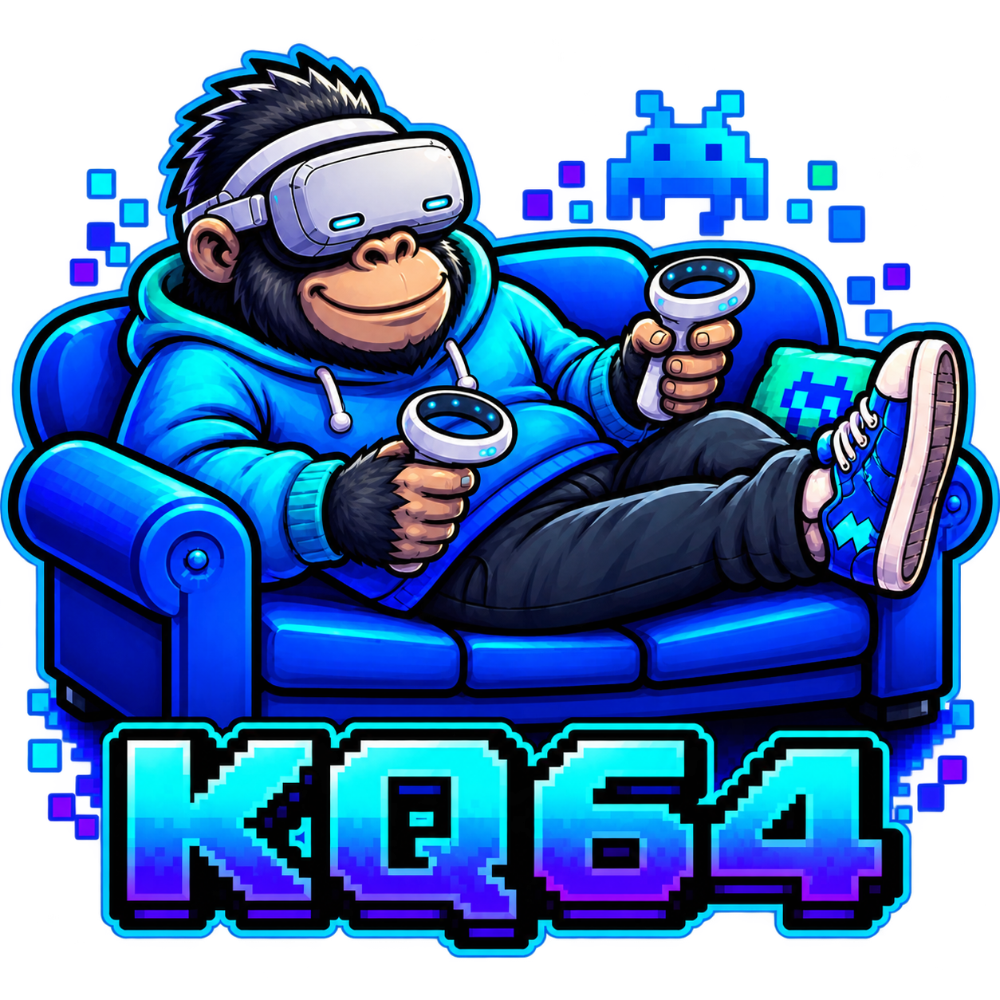

<p align="center">
  
</p>

<h1 align="center">KQ64</h1>
<p align="center"><strong>Stereoscopic Nintendo 64 emulation for Meta Quest.</strong></p>

<p align="center">
  <a href="https://github.com/permabulk69420-pixel/mupen64plus-ae/actions/workflows/build.yml"></a>
</p>

> [!WARNING]
> KQ64 is an early alpha. It already works well in a useful range of games, but compatibility is not universal and some games still have culling, menu, camera or stereo issues.

KQ64 is an open-source Quest-focused fork of Mupen64Plus-AE. It adds native OpenXR presentation, stereoscopic GLideN64 rendering, Quest Touch input and a small headset-friendly launcher.

The recommended mode is **Stereo Cinema**: a stable, world-locked stereoscopic screen with restrained head-camera movement. **Experimental Immersive** exposes more of the game world, but also exposes more of the assumptions and shortcuts used by original N64 cameras.

## Current status

KQ64 is developed and tested on **Meta Quest 3**. Other Quest headsets have not yet been properly validated.

Current highlights:

- stereoscopic GLideN64 rendering with separate per-eye geometry;
- Stereo Cinema and Experimental Immersive presentation modes;
- Quest Touch controls and an in-launcher Player 1 mapping panel;
- ROM library, folder import and the existing advanced Mupen64Plus-AE settings;
- high-resolution texture-pack support through the existing GLideN64 tools;
- in-headset recentering and Quest diagnostics.

## Install

1. Download the latest APK from [GitHub Releases](https://github.com/permabulk69420-pixel/mupen64plus-ae/releases).
2. Sideload it to the headset with SideQuest, ADB or another Android sideloading tool.
3. Open **Unknown Sources** on Quest and launch **KQ64**.
4. Import a folder containing your legally obtained N64 ROMs.
5. Start with **Stereo Cinema** unless you specifically want to test Experimental Immersive.

KQ64 uses its own Android application ID, so it can be installed alongside the normal M64Plus AE app.

## Good first games to try

These are useful starting points from current Quest 3 testing, not a complete compatibility list:

- Mario Kart 64
- Star Fox 64
- Doom 64
- Donkey Kong 64
- The Legend of Zelda: Ocarina of Time

Different regions, revisions, plugins, texture packs and game settings can produce different results.

## Controls

Quest Touch is mapped into the normal Mupen64Plus-AE input system.

- Use **Controls** in the KQ64 launcher to remap Player 1.
- Press both stick buttons together to recenter the VR view.
- Bluetooth controllers and the full profile editor remain available through **Advanced / Legacy**.

## Known limitations

- N64 games usually cull geometry outside the original camera view, so looking beyond the intended frame can reveal missing scenery or objects.
- Some menus, sprites, overlays, cutscenes and game-specific effects may be misaligned, doubled, flat or incorrectly clipped.
- Experimental Immersive can produce strange camera height, direction or cutscene behaviour.
- Compatibility is game-specific; a game booting does not guarantee every level or effect will render correctly.
- The launcher and controller mapper are new and still deliberately basic.

See [KNOWN_ISSUES.md](KNOWN_ISSUES.md) before reporting a bug.

## Building

KQ64 uses Android Studio, Java 21, Android SDK 36 and NDK 26.1.10909125.

```bash
git clone https://github.com/permabulk69420-pixel/mupen64plus-ae.git
cd mupen64plus-ae
./gradlew assembleRelease
```

The release APK is written to:

```text
app/build/outputs/apk/release/KQ64-release.apk
```

## Credits

KQ64 builds on a large amount of existing open-source work, including:

- [Mupen64Plus-AE](https://github.com/mupen64plus-ae/mupen64plus-ae)
- [Mupen64Plus](https://github.com/mupen64plus/mupen64plus-core)
- [GLideN64](https://github.com/gonetz/GLideN64)
- [Khronos OpenXR](https://www.khronos.org/openxr/)

KQ64 is an independent project and is not affiliated with or supported by Nintendo, Meta, the Mupen64Plus-AE maintainers or the GLideN64 maintainers. No ROMs, game files or proprietary Nintendo assets are included.

## License

The project remains licensed under the GNU General Public License, version 3. See [`gpl-license`](gpl-license) and the license files included with the upstream components.